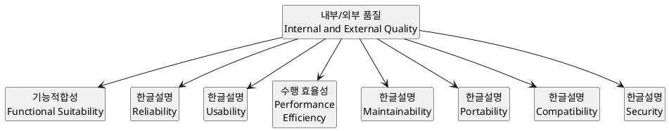
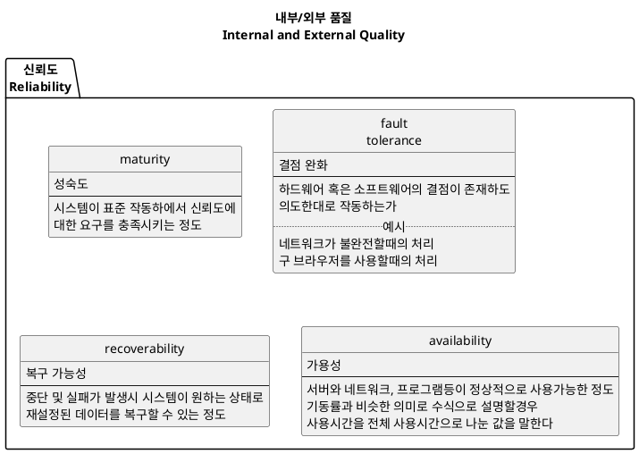
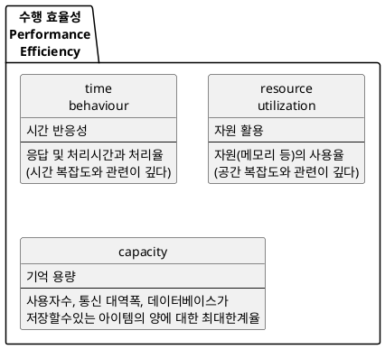
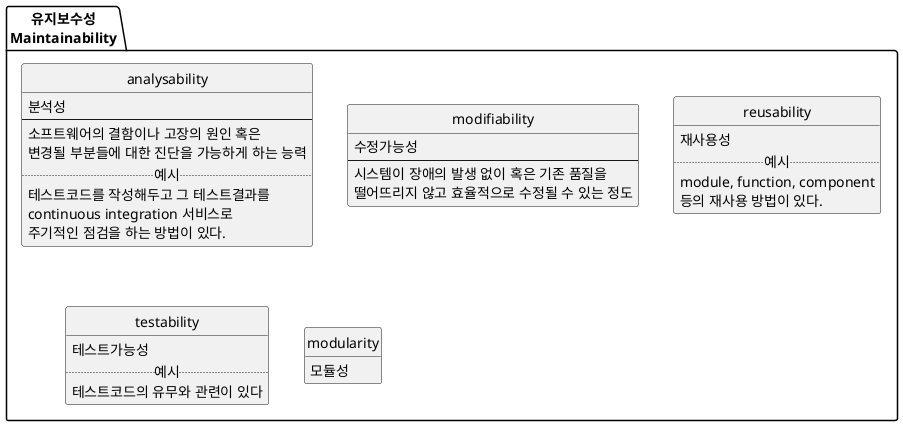

# 개요
이 글을 쓰는 목적은 다음과 같다.
* 개발자로서 좋은 코드를 작성하겠다는 목적을 위함
    * 여러 종류의 디자인 패턴의 장단점에 대한 분석을 체계적으로 정리하기 위함
    * 작성된 (혹은 작성할) 코드의 설계와 분석능력을 키워서 코드의 질적 향상을 위함
    * 머리속에 여기저기 흩어진 좋은 코드 또는 설계 작성법에 대한 지식을 정리하기 위함
* 개발자 관점뿐만이 아닌 사업가, 디자이너 및 사용자등의 관점으로도 소프트웨어를 바라보기 위함

**좋은 코드** 와 **좋은 설계** 의 목적은 소프트웨어 품질을 높이기 위함이다. 그러므로 소프트웨어 품질 기준에 대한 이야기를 시작으로 좋은 코드와 설계의 기준 및 방법(규칙)에 대해 정리해 보도록 하자.

# 소프트웨어 품질
개발자가 좋은 코드와 설계를 추구하는 근본적인 이유는 소프트웨어 품질을 높이기 위함이다. 소프트웨어 품질은 여려 요소들로 평가될수 있지만,  소프트웨어 품질 국제 표준인 ISO/IEC 25010 일부를 참고하여 정리하면 다음과 같다.

이러한 요소들중 개발자가 특히 관심가져야 할 요소들을 정리하였다.

당연하겠지만 ISO/IEC 25010 의 일부 내용에서 볼 수 있듯이 소프트웨어 품질은 여러 요소들을 고려해야 한다.
특히 우리 개발자가 집중해야되는 사항은 신뢰도, 성능(수행효율성), 유지보수성, 보안등이 있다.

# 좋은 코드의 판단 기준

## 응집도

http://raisonde.tistory.com/375
http://lazineer.tistory.com/93
https://zetawiki.com/wiki/%EC%9D%91%EC%A7%91%EB%8F%84,_%EA%B2%B0%ED%95%A9%EB%8F%84,_%EB%86%92%EC%9D%80_%EC%9D%91%EC%A7%91%EB%8F%84%2B%EB%82%AE%EC%9D%80_%EA%B2%B0%ED%95%A9%EB%8F%84
http://egloos.zum.com/gigaboy/v/10822457

## 결합도(의존도)

## 캡슐화

## 모듈화

## 추상성

## 다형성

## 가독성

##

# 코드 냄새(Code smell)

# 디자인 냄새(Design smell)

# 안티패턴(Anti-pattern)

# 좋은 코드를 위한 원칙

## SOLID

http://www.nextree.co.kr/p6960/
https://zetawiki.com/wiki/%EA%B0%9D%EC%B2%B4%EC%A7%80%ED%96%A5_%EA%B0%9C%EB%B0%9C_5%EB%8C%80_%EC%9B%90%EB%A6%AC_SOLID
https://ko.wikipedia.org/wiki/SOLID

### SRP

### OCP

### LSP

### ISP

### DIP

## 알고리즘

## 디자인 패턴

https://en.wikipedia.org/wiki/GRASP_(object-oriented_design)

## Package principles

### 응집도

#### 재사용 동등 원리 (REP)

#### 공통 재사용 원칙 (CRP)

#### 공통 폐쇄 원칙 (CCP)

### 결합도

#### 비주기 의존성 원칙 (ADP)

#### 안정 의존성 원칙 (SDP)

#### 안정적인 추상 원칙 (SAP)

SAP는 안정적인 패키지가 추상

# 코드 분석 도구
https://en.wikipedia.org/wiki/List_of_tools_for_static_code_analysis

위 내용을 다 정리하고 디자인 패턴책을 한권 정리, clean code책 정리 등 번갈아가며 수행
