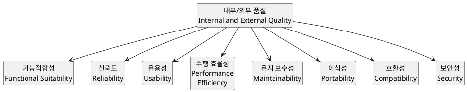
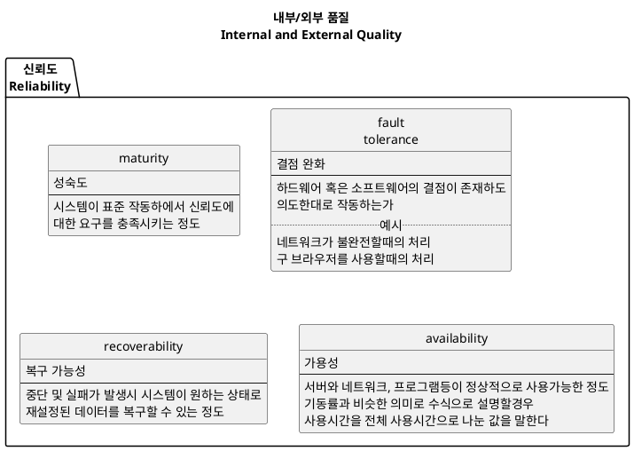
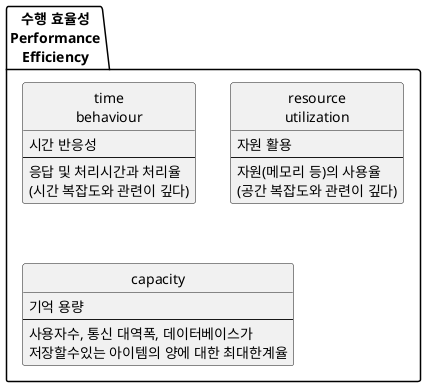
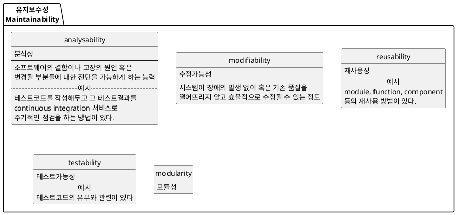
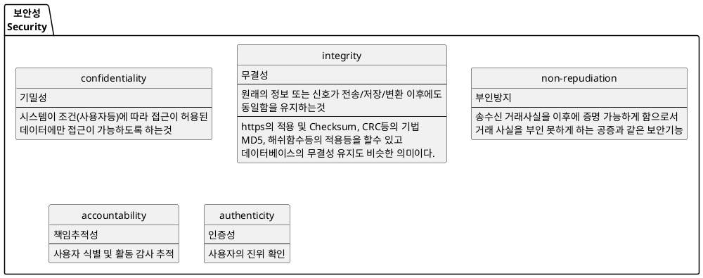

# 개요
이 글을 쓰는 목적은 다음과 같다.
* 개발자로서 좋은 코드를 작성하겠다는 목적
    * 여러 종류의 디자인 패턴의 장단점에 대한 분석을 체계적으로 정리
    * 작성된 (혹은 작성할) 코드의 설계와 분석능력을 키워서 코드의 질적 향상
    * 머리속에 여기저기 흩어진 좋은 코드 또는 설계 작성법에 대한 지식을 정리


**좋은 코드** 와 **좋은 설계** 의 목적은 소프트웨어 품질을 높이기 위함이다. 그러므로 소프트웨어 품질 기준에 대한 이야기를 시작으로 좋은 코드와 설계의 기준 및 방법(규칙)에 대해 정리해 보도록 하자.

# 소프트웨어 품질
소프트웨어 품질 국제 표준인 ISO/IEC 25010 일부를 참고하여 정리하면 다음과 같다.



이러한 요소들중 개발자가 특히 관심가져야 할 요소들을 정리하였다.






위의 내용에서 알 수 있듯이 소프트웨어 품질은 여러 요소들을 고려해야 한다.
특히 개발자가 집중해야되는 사항은 신뢰도, 성능(수행효율성), 유지보수성, 보안성등이 있다.


# 좋은 코드의 판단 기준

## 높은 응집도 낮은 결합도(High Cohesion, Loose Coupling)
이는 모듈 혹은 클래스, 더 나아가서 함수 작성시에 적용되는 사항이다.
일관성을 위해 모듈로 통합해서 글을 작성하였다.

> 응집도: 모듈내 상호 작용의 정도  
> 결합도: 두 모듈간의 상호 작용의 정도 (의존도)

**응집도가 낮다면**
* 여러 책임(기능)을 한 모듈이 지고 있다

**결합도가 높다면**
* 한 모듈의 수정에 영향받는 의존된 모듈이 다수이다.

**결국 응집도가 낮고 결합도가 높다면**
* 이해가 힘들고
* 변화에 예민하다 (1개의 기능변화에 다수의 모듈이 변경되야한다)

다음은 결합도를 낮은 순으로, 응집도를 높은 순으로 설명한 것이다.

```plantuml
class "내용 결합도" {
  Content coupling
  --
  하나의 모듈이 다른 모듈의 내부 동작을 수정하거나 내부 동작에 의존
  ==
  캡슐화에 의한 은닉화가 필요하다.
}

class "공통 결합도" {
  Common coupling
  --
  두 개의 모듈이 같은 글로벌 데이터를 공유(전역변수 공유)
  ==
  캡슐화한 모듈을 하나 더 만들어서 데이터를 제공한다.
}

class "외부 결합도" {
  External coupling
  --
  두 개의 모듈이 외부에서 도입된 데이터 포맷, 통신 프로토콜, 또는 디바이스 인터페이스를
  공유할 때 발생한다. 이는 기본적으로 외부 툴이나 디바이스와의 통신과 관련이 있다.
  ==
  외부에서 도입된 api에 맞는 모듈을 하나 더 만들어서 해결(어댑터 패턴 형태)
}

class "제어 결합도" {
  Control coupling
  --
  하나의 모듈이 다른 모듈으로 무엇을 해야하는지에 대한 정보를 넘겨줌으로써
  다른 모듈의 흐름을 제어
  ..
  여러 모듈이 한개(혹은 그 이상)의 기능에 대한 역할(책임)을 짊어지고 있기 때문에
  기능 변경시 caller, callee 모두 수정이 필요하다.
  ==
  오버로딩 혹은 1개 함수를 책임별로 분할하여 해결
}

class "스탬프 결합도" {
  Stamp coupling
  --
  복합 자료구조(구조체)의 값을 매개변수로 받는 경우
  ..
  자료구조의 형태가 바뀌면 수정이 필요하다.
  ==
  외부로 공개된 함수의 매개변수를 기본 자료형으로 변경하여 해결
}

class "자료 결합도" {
  Data coupling
  --
  기본 자료형의 값을 매개변수로 받는경우
  ..
  매개변수의 형태가 바뀌면 수정이 필요하다.
}

class "메시지 결합도" {
  Message coupling
  --
  가장 낮은 결합도이다. 이는 state decentralization을 통해 이룰 수 있고,
  컴포넌트 간의 통신은 파라메터나 메시지 패싱을 통해 이루어져 한다.
  (위키백과 참조)
}

"내용 결합도" <|-- "공통 결합도"
"공통 결합도" <|-- "외부 결합도"
"외부 결합도" <|-- "제어 결합도"
"제어 결합도" <|-- "스탬프 결합도"
"스탬프 결합도" <|-- "자료 결합도"
"자료 결합도" <|-- "메시지 결합도"

note right of "내용 결합도"
  module A{
    main(){
      B.setData(123)
    }
  }
  module B{
    data = 1;
    setData(data)
  }
end note

note right of "공통 결합도"
  dbTableNmae = 'ABC'
  //모듈 A, B가 전역변수 dbTableNmae 을 공유
  module A{
    deletePost()
  }
  module B{
    deleteUser()
  }

  // 해결방법: 캡슐화된 모듈 DB를 만들어서 사용
end note

note right of "외부 결합도"
  // 두 A, B 모듈은 외부에 공개된 API를 통한 통신으로
  // getData함수와 getName함수를 구현한다.  
  module A{
    getData()
  }
  module B{
    getName()
  }

  // 해결방법: 캡슐화된 외부 통신용 모듈을 만들어서 사용
end note

note right of "제어 결합도"
  module A{
    main(){
      B.local(true)
    }
  }
  module B{
    local(isExec){ //isExec 변수에 의해 흐름이 제어 됨
      if(isExec){

      }else{

      }
    }
  }
end note

note right of "스탬프 결합도"
  module canvas{
    struct point {x, y}
    drawPoint(point xy) // point라는 구조체가 의존됨
  }
  module B{
    add(a, b, c){
      canvas.point xy = {1, 3}
      canvas.drawPoint(xy)
    }
  }

  // 해결방법: 의존되는 데이터 구조체등을 기본데이터로 변경
  // drawPoint(x, y){
  //  이 안에서는 point 구조체를 사용해도 무관
  // }
  // 혹은 인터페이스를 이용
end note

note right of "자료 결합도"
  module A{
    add(a, b)
    // call by value
  }
  module B{
    c = add(a, b)
  }
end note

note right of "메시지 결합도"
  redux에서 사용되는 기법인듯 하나, 정확한 정의를 찾지 못하였다.
  외부 결합도와 헷갈리고, 정보가 없다
end note

hide empty fields
hide empty methods
hide circle
```

```plantuml
class "기능적 응집도" {
  Functional Cohesion
  --
  모듈 내부의 모든 기능이 단일한 목적을 위해 수행되는 경우
  강한 단일 지향헉인 목표(목적)을 가지는 모듈이여야 한다.
  단 한가지의 책임을 가져야 한다.
}

class "순차적 응집도" {
  Sequential Cohesion
  --
  모듈 내에서 한 활동으로 부터 나온 출력값을 다른 활동이 사용할 경우
}

class "통신적 응집도" {
  Communication Cohesion
  --
  동일한 입력과 출력을 사용하여 다른 기능을 수행하는 활동들이 모여있을 경우
}

class "절차적 응집도" {
  Procedural Cohesion
  --
  항상 특정 실행 순서를 따름에 따라 그륩화 하는 것
}

class "시간적 응집도" {
  Temporal Cohesion
  --
  연관된 기능이라기 보단 특정 시간에 처리되어야 하는 활동들을 한 모듈에서 처리할 경우
}

class "논리적 응집도" {
  Logical Cohesion
  --
  유사한 성격을 갖거나 특정 형태로 분류되는 처리 요소들이 한 모듈에서 처리되는 경우
}

class "우연적 응집도" {
  Coincidental Cohesion
  --
  모듈 내부의 각 구성요소들이 연관이 없을 경우
}

"기능적 응집도" <|-- "순차적 응집도"
"순차적 응집도" <|-- "통신적 응집도"
"통신적 응집도" <|-- "절차적 응집도"
"절차적 응집도" <|-- "시간적 응집도"
"시간적 응집도" <|-- "논리적 응집도"
"논리적 응집도" <|-- "우연적 응집도"

note right of "기능적 응집도"
  XML 어휘 분석 모듈
  거래 기록 읽기 모듈
end note

note right of "순차적 응집도"
  module DataControl{
    getData()
    deleteData(data)
    // getData 함수에서 출력된 data값을
    // deleteData함수에서 입력으로 사용.
  }
end note

note right of "통신적 응집도"
  module nameControl{
    // DB에 저장된 name
    print(name)
    select(name)
  }
end note

note right of "절차적 응집도"
  module fs{
    checkAuth()
    openFile()
    // openFile은 대체적으로 checkAuth함수로 체크하고 실행해야됨.
  }
end note

note right of "시간적 응집도"
  module init{
    init()
    memset()
    // 특정시간대(초기실행)에 실행되어야 되는 함수들 모임
  }
end note

note right of "논리적 응집도"
  module input{
    keyboardInput()
    mouseInput()
  }
end note

note right of "우연적 응집도"
  module A{
    addNumber(num1, num2)
    displayTerminal(text)
  }
end note

hide empty fields
hide empty methods
hide circle
```


http://raisonde.tistory.com/375
http://lazineer.tistory.com/93
https://zetawiki.com/wiki/%EC%9D%91%EC%A7%91%EB%8F%84,_%EA%B2%B0%ED%95%A9%EB%8F%84,_%EB%86%92%EC%9D%80_%EC%9D%91%EC%A7%91%EB%8F%84%2B%EB%82%AE%EC%9D%80_%EA%B2%B0%ED%95%A9%EB%8F%84
http://egloos.zum.com/gigaboy/v/10822457

## 캡슐화

## 모듈화

## 추상성

## 다형성

## 가독성

##

# 코드 냄새(Code smell)

# 디자인 냄새(Design smell)

# 안티패턴(Anti-pattern)


# 좋은 코드를 위한 원칙

## SOLID

http://www.nextree.co.kr/p6960/
https://zetawiki.com/wiki/%EA%B0%9D%EC%B2%B4%EC%A7%80%ED%96%A5_%EA%B0%9C%EB%B0%9C_5%EB%8C%80_%EC%9B%90%EB%A6%AC_SOLID
https://ko.wikipedia.org/wiki/SOLID

### SRP

### OCP

### LSP

### ISP

### DIP

## 알고리즘

## 디자인 패턴

https://en.wikipedia.org/wiki/GRASP_(object-oriented_design)

## Package principles

### 응집도

#### 재사용 동등 원리 (REP)

#### 공통 재사용 원칙 (CRP)

#### 공통 폐쇄 원칙 (CCP)

### 결합도

#### 비주기 의존성 원칙 (ADP)

#### 안정 의존성 원칙 (SDP)

#### 안정적인 추상 원칙 (SAP)

SAP는 안정적인 패키지가 추상

# 코드 분석 도구
https://en.wikipedia.org/wiki/List_of_tools_for_static_code_analysis

위 내용을 다 정리하고 디자인 패턴책을 한권 정리, clean code책 정리 등 번갈아가며 수행
