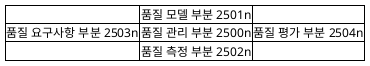
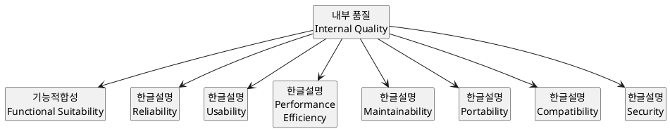
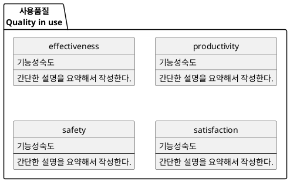

# 소프트웨어 품질 국제 표준 ISO/IEC 25010(ISO/IEC 9126)
* 소프트웨어 품질의 특성을 정의하고 품질 평가의 Metrics를 정의한 국제 표준
* **소프트웨어 품질을 객관적이고 계량적으로 평가할 수 있는 기본적인틀** 을 마련
* 사용자 관점에서 본 소프트웨어 품질 특성에 대한 표준
* 사용자, 개발자 모두에게 소프트웨어 제품의 품질을 평가하기 위한 지침

ISO/IEC 25010는 기존에 활용하고 있던 ISO/IEC 9126에서 현대 사회의 소프트웨어 특성을 고려해서 수정한 표준이다. 그외 소프트웨어의 개발계획과 관리 표준을 제시하는 ISO/IEC25001, 측정 참조 모델을 제시한 ISO/IEC25020 품질 요구사항 표준인 ISO/IEC25030 등 SQuaRE 프로젝트에 의해 소프트웨어 관련 표준화 작업이 완료되거나 진행중이다.



# 품질특성(Quality Characteristics)
품질특성(Quality Characteristics)은 내부 품질(Internal Quality), 외부 품질(External Quality) 그리고 사용품질(Quality in use)로 나누어 진다.

```plantuml
class "품질특성\nQuality Characteristics"

"품질특성\nQuality Characteristics" --> "내부 품질\nInternal Quality"
"품질특성\nQuality Characteristics" --> "외부 품질\nExternal Quality"
"품질특성\nQuality Characteristics" --> "사용품질\nQuality in use"

hide empty fields
hide empty methods
hide circle
```

## 내부 품질(Internal Quality)
내부 품질은 8개의 주특성으로 구분되며 이러한 주특성은 다시 부특성으로 세분화된다.



## 외부 품질(External Quality)
외부 품질은 내부 품질과 동일하게 8개의 주특성으로 구분되며 이러한 주특성은 다시 부특성으로 세분화된다.


### 내부/외부 품질 속성(Internal and External Quality attributes)

```plantuml
@startuml

Title "내부/외부 품질\nInternal and External Quality"

package "기능적합성\nFunctional Suitability" {
    class "completeness"{
        기능성숙도
        --
        간단한 설명을 요약해서 작성한다.
        test
    }
    class "correctness"{
        기능성숙도
        --
        간단한 설명을 요약해서 작성한다.
    }
    class "functional\nappropriateness"{
        기능성숙도
        --
        간단한 설명을 요약해서 작성한다.
    }
}
package "한글설명\nReliability" {
    class "maturity"{
        기능성숙도
        --
        간단한 설명을 요약해서 작성한다.
    }
    class "fault\ntolerance"{
        기능성숙도
        --
        간단한 설명을 요약해서 작성한다.
    }
    class "recoverability"{
        기능성숙도
        --
        간단한 설명을 요약해서 작성한다.
    }
    class "availability"{
        기능성숙도
        --
        간단한 설명을 요약해서 작성한다.
    }
}
package "한글설명\nUsability" {
    class "appropriateness\nrecognizability"{
        기능성숙도
        --
        간단한 설명을 요약해서 작성한다.
    }
    class "learnability"{
        기능성숙도
        --
        간단한 설명을 요약해서 작성한다.
    }
    class "operability"{
        기능성숙도
        --
        간단한 설명을 요약해서 작성한다.
    }
    class "user\ninterface\naesthetics"{
        기능성숙도
        --
        간단한 설명을 요약해서 작성한다.
    }
    class "user\nerror\nprotection"{
        기능성숙도
        --
        간단한 설명을 요약해서 작성한다.
    }
    class "accessibility"{
        기능성숙도
        --
        간단한 설명을 요약해서 작성한다.
    }
}
package "한글설명\nPerformance\nEfficiency" {
    class "time\nbehaviour"{
        기능성숙도
        --
        간단한 설명을 요약해서 작성한다.
    }
    class "resource\nutilization"{
        기능성숙도
        --
        간단한 설명을 요약해서 작성한다.
    }
    class "capacity"{
        기능성숙도
        --
        간단한 설명을 요약해서 작성한다.
    }
}
package "한글설명\nMaintainability" {
    class "analyzability"{
        기능성숙도
        --
        간단한 설명을 요약해서 작성한다.
    }
    class "modifiability"{
        기능성숙도
        --
        간단한 설명을 요약해서 작성한다.
    }
    class "reusability"{
        기능성숙도
        --
        간단한 설명을 요약해서 작성한다.
    }
    class "testability"{
        기능성숙도
        --
        간단한 설명을 요약해서 작성한다.
    }
    class "modularity"{
        기능성숙도
        --
        간단한 설명을 요약해서 작성한다.
    }
}
package "한글설명\nPortability" {
    class "adaptability"{
        기능성숙도
        --
        간단한 설명을 요약해서 작성한다.
    }
    class "installability"{
        기능성숙도
        --
        간단한 설명을 요약해서 작성한다.
    }
    class "replaceability"{
        기능성숙도
        --
        간단한 설명을 요약해서 작성한다.
    }
}
package "한글설명\nCompatibility" {
    class "co-existence"{
        기능성숙도
        --
        간단한 설명을 요약해서 작성한다.
    }
    class "interoperability"{
        기능성숙도
        --
        간단한 설명을 요약해서 작성한다.
    }
}
package "한글설명\nSecurity" {
    class "confidentiality"{
        기능성숙도
        --
        간단한 설명을 요약해서 작성한다.
    }
    class "integrity"{
        기능성숙도
        --
        간단한 설명을 요약해서 작성한다.
    }
    class "non-repudiation"{
        기능성숙도
        --
        간단한 설명을 요약해서 작성한다.
    }
    class "accountability"{
        기능성숙도
        --
        간단한 설명을 요약해서 작성한다.
    }
    class "authenticity"{
        기능성숙도
        --
        간단한 설명을 요약해서 작성한다.
    }
}

"completeness" -[hidden]right-> "correctness"
"correctness" -[hidden]right-> "functional\nappropriateness"

"maturity" -[hidden]right-> "fault\ntolerance"
"fault\ntolerance" -[hidden]right-> "recoverability"
"maturity" -[hidden]down-> "availability"

"appropriateness\nrecognizability" -[hidden]right-> "learnability"
"learnability" -[hidden]right-> "operability"
"appropriateness\nrecognizability" -[hidden]down-> "user\ninterface\naesthetics"
"user\ninterface\naesthetics" -[hidden]right-> "user\nerror\nprotection"
"user\nerror\nprotection" -[hidden]right-> "accessibility"

"time\nbehaviour" -[hidden]right-> "resource\nutilization"
"resource\nutilization" -[hidden]right-> "capacity"

"analyzability" -[hidden]right-> "modifiability"
"modifiability" -[hidden]right-> "reusability"
"analyzability" -[hidden]down-> "testability"
"testability" -[hidden]right-> "modularity"

"adaptability" -[hidden]right-> "installability"
"installability" -[hidden]right-> "replaceability"

"co-existence" -[hidden]right-> "interoperability"

"confidentiality" -[hidden]right-> "integrity"
"integrity" -[hidden]right-> "non-repudiation"
"confidentiality" -[hidden]down-> "accountability"
"accountability" -[hidden]right-> "authenticity"

"completeness" -[hidden]down-> "maturity"
"availability" -[hidden]down-> "appropriateness\nrecognizability"
"user\ninterface\naesthetics" -[hidden]down-> "time\nbehaviour"
"time\nbehaviour" -[hidden]down-> "analyzability"
"testability" -[hidden]down-> "adaptability"
"adaptability" -[hidden]down-> "co-existence"
"co-existence" -[hidden]down-> "confidentiality"

hide empty fields
hide empty methods
hide circle
@enduml
```




## 사용품질(Quality in use)
Quality in use(사용품질)은 사용자 관점의 품질을 말한다.

### 사용품질 속성(Quality in use attributes)



## 관계

```plantuml
class "품질특성\nQuality Characteristics"
class "내부 품질\nInternal Quality"
class "외부 품질\nExternal Quality"
class "사용품질\nQuality in use"

"품질특성\nQuality Characteristics" --> "내부 품질\nInternal Quality"
"품질특성\nQuality Characteristics" --> "외부 품질\nExternal Quality"
"품질특성\nQuality Characteristics" --> "사용품질\nQuality in use"

"사용품질\nQuality in use" .left.> "외부 품질\nExternal Quality" : 의존
"외부 품질\nExternal Quality" .left.> "내부 품질\nInternal Quality" : 의존
"내부 품질\nInternal Quality" .left.> "프로세스 품질\nProcess Quality" : 의존

"사용품질\nQuality in use" <|.left. "외부 품질\nExternal Quality" : 영향
"외부 품질\nExternal Quality" <|.left. "내부 품질\nInternal Quality" : 영향
"내부 품질\nInternal Quality" <|.left. "프로세스 품질\nProcess Quality" : 영향

hide empty fields
hide empty methods
hide circle
```


https://en.wikipedia.org/wiki/ISO/IEC_9126
http://www.splex.co.kr/isoiec-9126-25010
https://www.iso.org/standard/35733.html

http://ryudwig.tistory.com/entry/SW-%ED%92%88%EC%A7%88-%ED%8A%B9%EC%84%B1-ISO-9126
http://solarixer.blogspot.kr/2007/12/iso-9126.html


# Functionality
A set of attributes that bear on the existence of a set of functions and their specified properties. The functions are those that satisfy stated or implied needs.

* Suitability
* Accuracy
* Interoperability
* Security
* Functionality compliance

# Reliability
A set of attributes that bear on the capability of software to maintain its level of performance under stated conditions for a stated period of time.

* Maturity
* Fault tolerance
* Recoverability
* Reliability compliance

# Usability
A set of attributes that bear on the effort needed for use, and on the individual assessment of such use, by a stated or implied set of users.

* Understandability
* Learnability
* Operability
* Attractiveness
* Usability compliance

# Efficiency
A set of attributes that bear on the relationship between the level of performance of the software and the amount of resources used, under stated conditions.

* Time behaviour
* Resource utilization
* Efficiency compliance

# Maintainability
A set of attributes that bear on the effort needed to make specified modifications.

* Analyzability
* Changeability
* Stability
* Testability
* Maintainability compliance

# Portability
A set of attributes that bear on the ability of software to be transferred from one environment to another.

* Adaptability
* Installability
* Co-existence
* Replaceability
* Portability compliance
