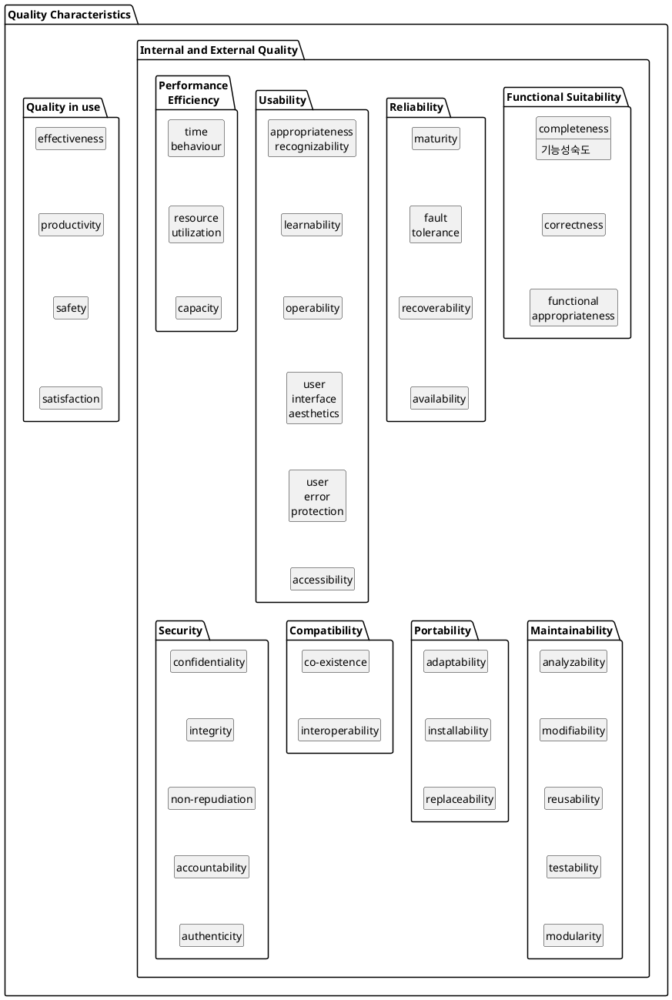

# ISO/IEC 25010(ISO/IEC 9126)
* 소프트웨어 품질의 특성을 정의하고 품질 평가의 Metrics를 정의한 국제 표준
* 사용자 관점에서 본 소프트웨어 품질 특성에 대한 표준
* 사용자, 개발자 모두에게 소프트웨어 제품의 품질을 평가하기 위한 지침
* 소프트웨어 품질을 객관적이고 계량적으로 평가할 수 있는 기본적인틀을 마련

소프트웨어 품질 Metrics는 주특성 8개로 구분되며 이러한 주특성은 다시 부특성으로 세분화된다. 부특성은 내부 Metrics나 외부 Metrics에 의해 측정이 가능하다. Quality in use(사용 품질)는 사용자 관점의 품질을 말한다.

https://en.wikipedia.org/wiki/ISO/IEC_9126
http://www.splex.co.kr/isoiec-9126-25010
https://www.iso.org/standard/35733.html

http://ryudwig.tistory.com/entry/SW-%ED%92%88%EC%A7%88-%ED%8A%B9%EC%84%B1-ISO-9126
http://solarixer.blogspot.kr/2007/12/iso-9126.html

# Functionality
A set of attributes that bear on the existence of a set of functions and their specified properties. The functions are those that satisfy stated or implied needs.

* Suitability
* Accuracy
* Interoperability
* Security
* Functionality compliance

# Reliability
A set of attributes that bear on the capability of software to maintain its level of performance under stated conditions for a stated period of time.

* Maturity
* Fault tolerance
* Recoverability
* Reliability compliance

# Usability
A set of attributes that bear on the effort needed for use, and on the individual assessment of such use, by a stated or implied set of users.

* Understandability
* Learnability
* Operability
* Attractiveness
* Usability compliance

# Efficiency
A set of attributes that bear on the relationship between the level of performance of the software and the amount of resources used, under stated conditions.

* Time behaviour
* Resource utilization
* Efficiency compliance

# Maintainability
A set of attributes that bear on the effort needed to make specified modifications.

* Analyzability
* Changeability
* Stability
* Testability
* Maintainability compliance

# Portability
A set of attributes that bear on the ability of software to be transferred from one environment to another.

* Adaptability
* Installability
* Co-existence
* Replaceability
* Portability compliance
